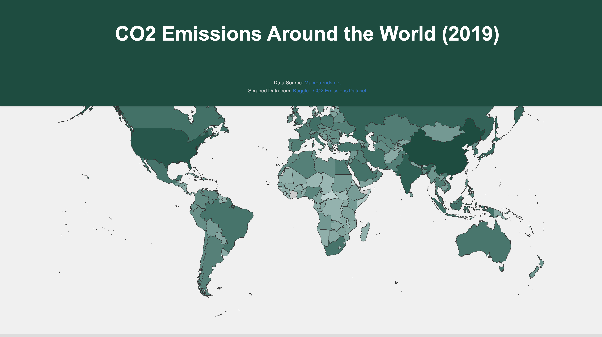

# Examining CO2 Emissions Around the World

## Andrew Baker

## Description
As the climate crisis continues to worsen, it is important to take a critical lens to the carbon emissions being produced by various regions and countries. Understanding what drives these outcomes as well as who contributes what will get us closer to developing effective policies to slow rising temperatures.

## Screenshot

## Data Sources
The data used for the project was taken from Kaggle at the following link: [Kaggle CO2 Emissions](https://www.kaggle.com/datasets/ravindrasinghrana/carbon-co2-emissions/data).

The above Kaggle dataset was scraped from an open source website called Macrotrends: [Macrotrends](https://www.macrotrends.net/countries).
