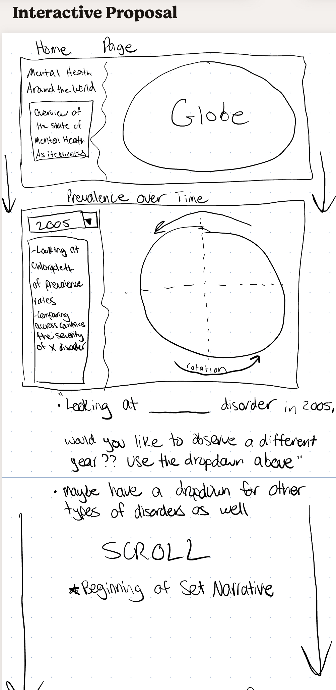

# Name
Andrew Baker

# Topic
Truly, I believe one of the biggest crises we're facing in both the U.S. as well as accross the world is the mental health crisis. Protecting our mental health is essential to living a happy and healthy life, and, unfortuneately, people are suffering at significant rates, often without proper treatment.

As someone who has first-hand experience with anxiety, depression, and bipolar disorder, this topic is extremely important to me, as is spreading awareness of the prevalence of these issues.

Therefore, I wanted to find data for countries over time that contains measures such as:
- prevalence rates
- Burden of a disease/net effect on population
- existing treatments

# Data
1. [Mental Health- Kaggle](https://www.kaggle.com/datasets/imtkaggleteam/mental-health?select=3-+adult-population-covered-in-primary-data-on-the-prevalence-of-major-depression.csv)

### Description
This data contains 7 different files:
1. **mental-illness-prevalence** (observation for each country for each year 1990-2019)
- gives shares of population with various disorders, including bipolar, anxiety, eating, etc.

2. **burden-disease-from-each-mental-illness** (same granularity as above)
- burden is measured in DALYs (disability-adjusted life year), and it is given for different mental health disorders

3. **adult-population-covered-...-on-the-prevalence-of-major-depression** (unsure about the wording here; data is by region instead of by country, and data only exists for 2008)
- again, unsure about wording here, and I will have a question on this

4. **adult-population-covered-...-on-the-prevalence-of-mental-illness** (unsure about the wording here; data is by region instead of by country, and data only exists for 2008)
- again, I have a question on this

5. **anxiety-disorders-treatment-gap** (has data for some countries, with one year of observation for each country; conditional upon having anxiety disorder)
- share of population receiving adequate vs inadequate care

6. **depressive-symptoms-across-us-population** (zooming in on the US in 2014, deatils the frequencies of various depression symptoms for Americans with depression)
- explores the freqencies and severities of these depression symptoms in the US

7. **number-of-countries-with-primary-data-on-prevalence-of-mental-illnesses-in-the-global-burden-of-disease-study** (in 2019, how many countries are keeping track of data related to ____ disorder? For example, there are 58 countries with primary data on alcohol use disorder, but only 2 countries with primary data on personality disorders)
- maybe isn't as important, but does give insight as to what countries are putting prioity on what disorders, as well as what disorders are not getting much attention around the world

# Examples of interactives
[Spain Lives in Flats](https://especiales.eldiario.es/spain-lives-in-flats/)
- I like this idea of a scrolling webpage that doesn't allow for user input, but instead has a set narrative that explores this topic through different zooms of the globe
- Something like this could be conducive to exploring the trends of mental health disorders for different countries/regions around the world as one scrolls down the page
- These trends could be prevalence over time, burden over time, prevalence differences across the world, etc
- As scrolling ocurss, we'll focus on different regions/countries, and provide text/graphs relating to the trends in mental health

[The Ocean Cleanup](https://theoceancleanup.com/sources/)
- I also like this concept, where the user can decide which parts of the world they would like to explore by clicking on different parts of the map
- This (in my mind) will be more difficult on my end, but I also believe this would be "more interactive"
- A user could click on/type in a country they'd like to learn about, and then the map could zoom in on that country, highlight it, and give some information/perhaps another graph displaying the mental health data for the country

[Scrollytelling](https://www.vev.design/blog/scrollytelling-examples/)
- Back to the concept used by "Spain Lives in Flats"
- Scrollytelling is the concept I've been discussing of following a narrative as a user scrolls down the page, all the while the background and other visuals are changing to help support this narrative
- There are several examples on this page, including one on [The impact of COVID on Africa](https://mo.ibrahim.foundation/our-research/data-stories/covid-19-africa-challenging-road-recovery)

# Questions
1. I mentioned this above, but I am confused by two of the files in the Kaggle data, which are the "adult_population_covered" datasets. Could you held clue me into what these datasets are describing?
2. Do you think this data alone would be enough to build a quality interactive website? I'm thinking I can build a narrative off the data and do something like the "Spain Lives In Flats" site where we keep looking at different parts of the world. If not, I can for sure look for more data, but I've found that sometimes one data source can be enough like with my static project
3. Something like "Spain Lives in Flats" does not necessarily have lots of "user interactivity", but instead employs more of the aforementioned scrollytelling method. Would choosing something like this be appropriate for this project, or does there need to be clearer user input onto the page?

# Mock-up
- The general idea is to do something similar to what "Spain Lives in Flats" has done, which mostly follows a scrollable narrative that adjusts the visualizations as one goes down the page
- I would begin with an overview, showing a globe with the text panel introducing the mental health crisis and the general impact it can have on society
- Next, before getting into the scrollable narrative, I want the first part to allow the user to explore the global data, focusing on a rotating globe that shows a chloropleth of the prevalence of a a specific disorder for each country in a specific year
    - I'd like to have a drop down here that allows the user to change the year we are looking at
    - I'd also like the user to be able to chage what disorder they are looking at as well
- following this would begin the fixed narrative, which zooms in on different regions of the world and highlights mental health disorder prevalence, with pop out graphs that perhaps discuss the burden (DALYs) of these countries, potentially cluing us into how well these issues are being handled
- The above info about how well issues are being handled could be backed up by the share of the population which is receiving proper care for anxiety
- Later in the narrative, I'd like to zoom in on the U.S. and its depression data (since we are specifically given this) and explore both the frequency and severity of this
